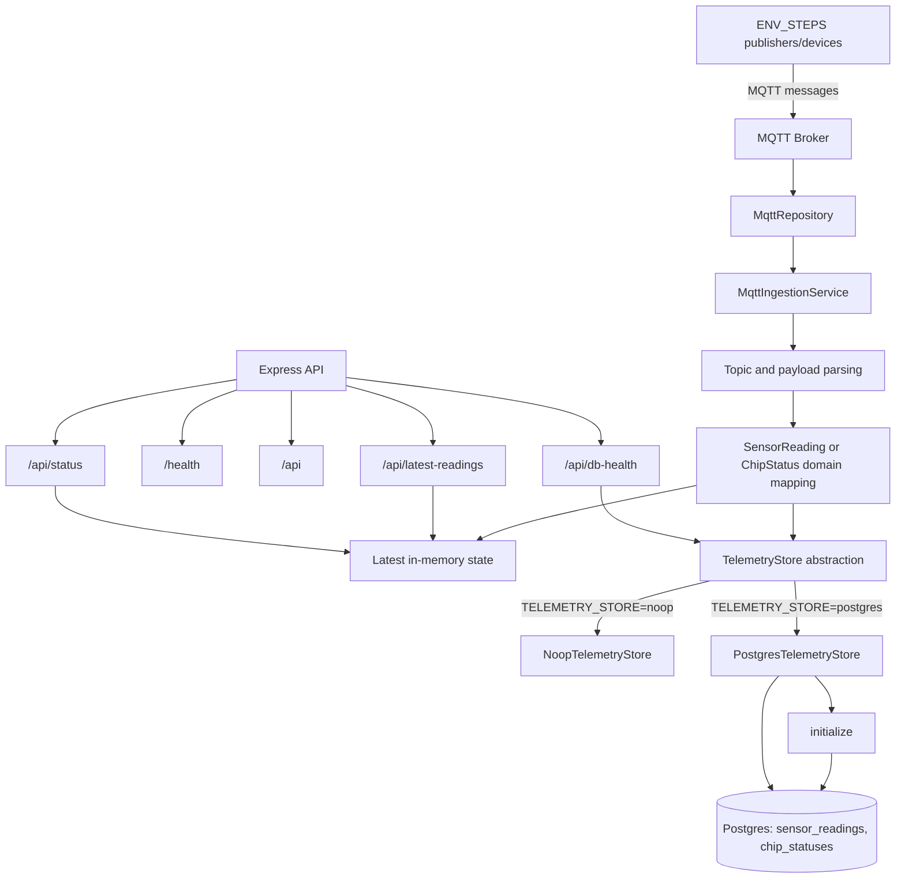
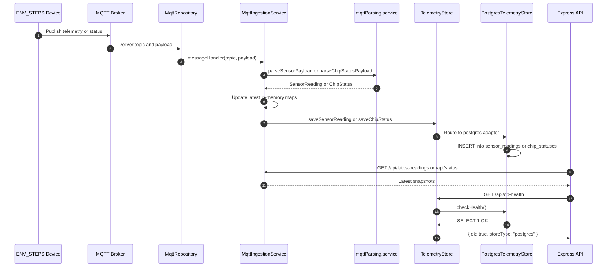

# Flow (Current Implementation)

For restart context and working preferences, see `HANDOVER.md` first.

Here is the current implemented flow (excluding tests), end-to-end.

## Startup

- App boots in `app.ts`: loads env, creates Express app, mounts API router, and starts services.
- On startup it initializes telemetry storage first, then starts MQTT ingestion.
- Startup logs active store type (`postgres` or `noop`) so runtime mode is visible.

## Configuration

- MQTT connection and reconnect settings come from env via `mqtt.config.ts`.
- Telemetry store type is chosen from env in `telemetry.Store.ts`:
  - `TELEMETRY_STORE=postgres` -> Postgres adapter
  - otherwise -> no-op adapter
- Postgres pool and table/schema names are read from env in the same store factory.

## MQTT Ingestion Pipeline

- MQTT client lifecycle, reconnect, subscribe, and message dispatch are handled in `mqtt.Repository.ts`.
- Ingestion orchestrator is `mqttIngestion.service.ts`:
  - subscribes to `sensors/#` and `status/running`
  - parses incoming JSON
  - updates latest in-memory maps
  - writes asynchronously to the selected telemetry store

## Parsing and Domain Mapping

- Topic and payload parsing lives in `mqttParsing.service.ts`.
- Sensor model mapping in `sensorReading.model.ts`:
  - core fields (`mcuId`, `sensorType`, `sensorId`, `timestamp`, optional `tempC`)
  - numeric unknown fields -> `metrics`
  - non-numeric unknown fields -> `extras`
  - full original payload copy -> `raw`
- Chip status mapping is in `chipStatus.model.ts`.

## Storage Layer

- Store contract (`TelemetryStore`) is defined in `telemetry.Store.ts`.
- Default safe implementation is `NoopTelemetryStore`.
- Concrete DB adapter is `PostgresTelemetryStore.ts`:
  - `initialize()` creates tables/indexes if missing
  - `saveSensorReading()` inserts sensor rows
  - `saveChipStatus()` inserts status rows
  - `checkHealth()` runs `SELECT 1`
- Current env uses Postgres, so writes go to `public.sensor_readings` and `public.chip_statuses`.

## API Surface

- Router is `api.routes.ts`, handlers in `mqttIngestion.controller.ts`.
- Current endpoints:
  - `/health` (app liveness)
  - `/api` (endpoint listing)
  - `/api/latest-readings` (latest in-memory sensor snapshots)
  - `/api/status` (latest in-memory chip status snapshots)
  - `/api/db-health` (telemetry store health; Postgres does live DB ping)

## As-Built Flow Diagram

## Runtime Sequence (Compact)

1. `app.ts` starts, initializes telemetry store, then starts MQTT ingestion.
2. `mqtt.Repository.ts` connects/subscribes and forwards MQTT messages.
3. `mqttIngestion.service.ts` parses and maps payloads.
4. Parsed data is written to latest in-memory maps and to the selected telemetry store.
5. `PostgresTelemetryStore` persists into `sensor_readings` and `chip_statuses`.
6. API returns latest snapshots and DB health via `/api/*` endpoints.

## Runtime Sequence Diagram

